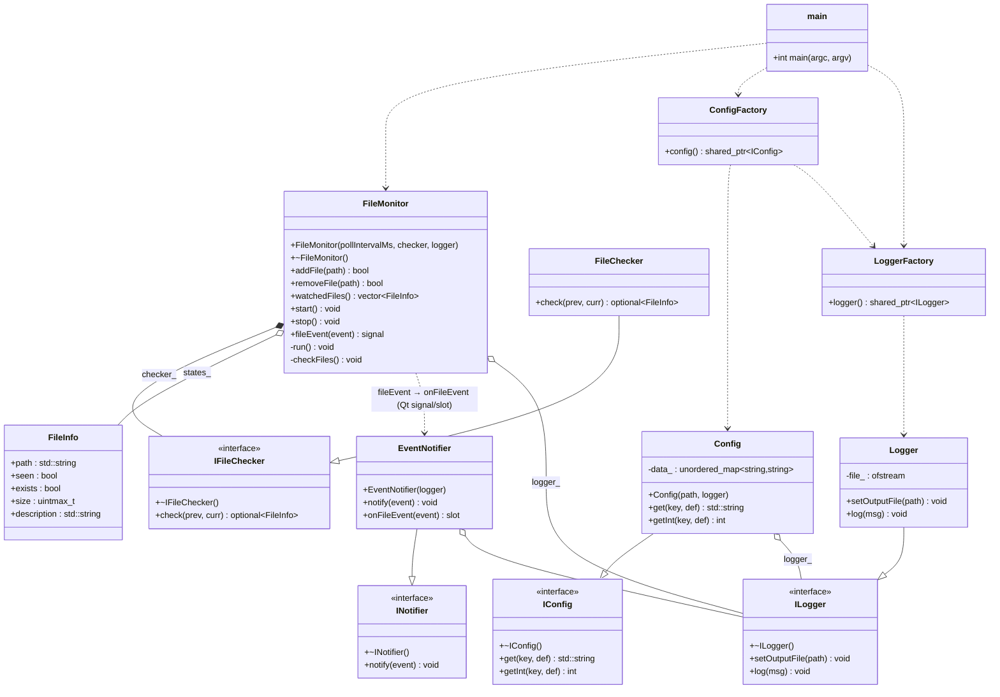

# Лабораторная работа по предмету: "Технологии программирования"

## Тема: "Наблюдение за файлами"

> 4 курс 2 семестр \
> Студент группы 932223 - Евсеев Александр Сергеевич \

## Постановка задачи

Необходимо разработать консольное приложение для наблюдения за выбранными файлами.

В рамках лабораторной работы у файла отслеживаются две характеристики:

- факт существования;
- размер.

Программа должна выводить уведомления при изменении состояния файла.

Поддерживаются следующие сценарии:

1. Файл существует (первое наблюдение или появление): выводится сообщение о существовании файла и его текущий размер.
2. Файл существует и был изменён (изменился размер): выводится сообщение об изменении и новый размер файла.
3. Файл отсутствует (был удалён): выводится сообщение об отсутствии файла.

Обработка изменений выполняется через механизм сигналов и слотов Qt.

## Зависимости

Для сборки и запуска нужны:

- **Qt** v5.12 (используется только модуль Core ради сигналов/слотов)
- **CMake** v3.16
- **Стандарт C++** 17

Qt задействован **только** для механизма Observer (сигнал/слот между `FileMonitor` и
`EventNotifier`). Всё остальное — стандартная библиотека C++ (`std::string`,
`std::filesystem`, `std::unordered_map`, `std::thread`).

## Архитектура решения

Основные компоненты:

- **main.cpp** — точка входа приложения. Отвечает за работу с терминалом, разбор
  аргументов командной строки и интерактивный цикл команд.
- **FileMonitor** — Владеет списком наблюдаемых файлов, их
  состоянием (`states_`) и единым чекером. В отдельном потоке опрашивает файлы с
  заданным интервалом, делает по одному снимку на файл и при изменении испускает
  сигнал `fileEvent`.
- **IFileChecker / FileChecker** — проверка файла. Чекер сравнивает
  два соседних снимка (их передаёт `FileMonitor`) и решает, нужно ли
  событие. `FileChecker` объединяет слежение за существованием и размером в одном методе `check`.
- **INotifier / EventNotifier** — приёмник событий. Слот `onFileEvent`
  подключается к сигналу монитора и пишет произошедшее в журнал.
- **IConfig / Config** — конфигурация приложения. Читает `config.txt` в
  конструкторе (формат `key = value`); экземпляр выдаёт фабрика `config()`.
- **ILogger / Logger** —  журнал событий; экземпляр выдаёт
  фабрика `logger()`.

### UML-диаграмма классов

### Инструкция для пользователя 

.

Доступные команды  консоли:

- `add <path>` — добавить файл в список наблюдения;
- `remove <path>` — удалить файл из списка наблюдения;
- `list` — вывести список наблюдаемых файлов с их состоянием;
- `quit` (или `exit`) — завершить работу программы.

Параметры времени выполнения задаются в `config.txt`:

- `log_file` — файл журнала;
- `poll_interval_ms` — период опроса наблюдаемых файлов в миллисекундах.

## Тестирование

### Пользовательские тест-кейсы

#### Case №1

Проверка запуска и команды list без файлов

- Входные параметры: -
  - Шаг 1 - выполнить запуск `./build/src/file_watcher`
  - Шаг 2 - ввести команду `list`
- Результат: приложение не завершается, в консоли выводится сообщение, что наблюдаемых файлов нет

#### Case №2

Проверка добавления файла и команды list

- Входные параметры: существует файл `testing/file1.txt`
  - Шаг 1 - запустить приложение `./build/src/file_watcher`
  - Шаг 2 - ввести `add testing/file1.txt`
  - Шаг 3 - ввести `list`
- Результат: путь `testing/file1.txt` присутствует в списке наблюдаемых, рядом отображается размер

#### Case №3

Проверка изменения файла с изменением размера

- Входные параметры: файл `testing/file1.txt` уже добавлен командой `add`
  - Шаг 1 - дописать символ в `testing/file1.txt`
- Результат: появляется сообщение об изменении файла и выводится новый размер

#### Case №4

Проверка удаления и повторного создания файла

- Входные параметры: файл `testing/file_recreate.txt` добавлен в наблюдение
  - Шаг 1 - удалить файл `testing/file_recreate.txt`
  - Шаг 2 - повторно создать файл `testing/file_recreate.txt`
- Результат: сначала фиксируется событие удаления, затем событие существования файла

#### Case №5

Проверка удаления из наблюдения

- Входные параметры: файл `testing/file1.txt` добавлен через `add`
  - Шаг 1 - ввести `remove testing/file1.txt`
  - Шаг 2 - ввести `list`
  - Шаг 3 - изменить файл в отдельном терминале
- Результат: файл отсутствует в списке наблюдения, новые события по нему не появляются

